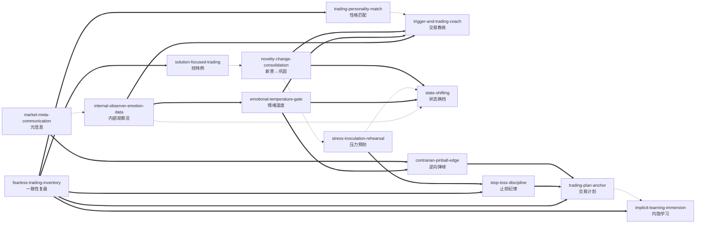

# 《投资交易心理分析》— Skill Index

> 本书由 cangjie-skill 蒸馏，共产出 **14** 个 skills。
> 处理时间: 2026-08-18

## 关于这本书

- **作者**: 布雷特·N. 斯蒂恩博格（Brett N. Steenbarger）
- **出版年**: 2002/2003（中文典藏版 2018）
- **一句话主旨**: 交易失败大多不是方法问题，而是"自我反应模式"问题——把情绪当数据、把执行当纪律、把复盘当研究，才能让技术发挥应有的作用。
- **整书理解**: 见 [BOOK_OVERVIEW.md](./BOOK_OVERVIEW.md)
- **精华长文** (不读全书看这篇): [DIGEST.md](./DIGEST.md)
- **术语词典**: [GLOSSARY.md](./GLOSSARY.md)

---

## Skill 列表 (按主题分组)

### 1. 复盘与审查 (Review & Diagnosis)

- [`fearless-trading-inventory`](./fearless-trading-inventory/SKILL.md) — 大无畏清单：一次性审查全部交易历史，找五个维度的执行不一致
- [`solution-focused-trading`](./solution-focused-trading/SKILL.md) — 聚焦解决方案：不纠错，找"做对了的时刻"并放大
- [`trading-personality-match`](./trading-personality-match/SKILL.md) — 交易-性格匹配：很多"情绪问题"其实是"方法不适合性格"的结构问题

### 2. 情绪数据与闸门 (Emotion as Data & Gates)

- [`internal-observer-emotion-data`](./internal-observer-emotion-data/SKILL.md) — 内部观察员：情绪即数据，不迷失在自己的感觉中
- [`emotional-temperature-gate`](./emotional-temperature-gate/SKILL.md) — 情绪温度测量：激发×效价双维度读数，状态不对不交易
- [`state-shifting`](./state-shifting/SKILL.md) — 状态换挡：用身体/环境改变状态，恢复理性决策

### 3. 执行纪律 (Execution Discipline)

- [`stop-loss-discipline`](./stop-loss-discipline/SKILL.md) — 止损纪律：价格/指标/时间三分法，失败即成本
- [`trading-plan-anchor`](./trading-plan-anchor/SKILL.md) — 交易计划=船锚：大声说出计划 + 假设检验 + 先锋头寸
- [`stress-inoculation-rehearsal`](./stress-inoculation-rehearsal/SKILL.md) — 压力预防：开市前脑海"放电影"，对最坏情形脱敏
- [`trigger-and-trading-coach`](./trigger-and-trading-coach/SKILL.md) — 触发器→消极磁带→交易教练：打断自动化坏行为

### 4. 改变与学习 (Change & Learning)

- [`novelty-change-consolidation`](./novelty-change-consolidation/SKILL.md) — 新意→改变→巩固：为什么改变总打回原形，以及怎么防止
- [`implicit-learning-immersion`](./implicit-learning-immersion/SKILL.md) — 内隐学习/沉浸式训练：技能是练出来的，不是学出来的

### 5. 市场解读与策略 (Market Reading & Strategy)

- [`market-meta-communication`](./market-meta-communication/SKILL.md) — 市场元信息：怎么走比走到哪更重要
- [`contrarian-pinball-edge`](./contrarian-pinball-edge/SKILL.md) — 逆向交易的弹球窍门：找到设计之外的规律，反复使用

---

## 引用图



图例:
- `===>` composes-with（配合使用）
- `-.->` contrasts-with（两种可选方案）

---

## 推荐学习顺序

从依赖关系与技能树推导（先底层能力，再执行纪律，最后策略）。

1. **internal-observer-emotion-data** — 最基础：没有观察能力，情绪数据无法采集，其余情绪类技能失去前提。
2. **emotional-temperature-gate** — 依赖观察员：把观察能力变成"今天该不该交易"的仪表读数。
3. **state-shifting** — 与测温互补：状态不对时用身体/环境换挡；也与压力预防互补（事中 vs 事前）。
4. **fearless-trading-inventory** — 入门第一件实操：用清单审查历史，识别执行不一致。
5. **solution-focused-trading** — 依赖复盘结果：从历史中找例外，确定"往哪里改"。
6. **trading-plan-anchor** — 把以上收敛成可执行计划：说出来、写假设、先锋头寸。
7. **stop-loss-discipline** — 计划的关键部件：三分法止损 + 失败即成本。
8. **stress-inoculation-rehearsal** — 组合止损：有规则但怕执行 → 开盘前预演最坏情形。
9. **trigger-and-trading-coach** — 触发失控时的即时打断，用教练角色替换消极磁带。
10. **novelty-change-consolidation** — 改变的新意+巩固：防止打回原形，固化新行为。
11. **implicit-learning-immersion** — 把技能练进肌肉记忆：模拟+环境变化+重复。
12. **trading-personality-match** — 结构性诊断：若执行总失败，先查方法是否适合性格。
13. **market-meta-communication** — 提升市场解读：怎么走比走到哪更重要。
14. **contrarian-pinball-edge** — 策略差异化：在元信息信号上做逆向，机械化重复。

---

## 安装使用

本目录是构建产物，宿主不会从这里加载 skill。要让 agent 真正调用，把 skill 目录复制到宿主的 skills 目录：

```bash
# 用户级（所有项目可用）— Cursor
cp -r fearless-trading-inventory ~/.cursor/skills/
# ... 每个 skill 目录同理
```

---

## 接入 darwin-skill

所有 skill 均带有 `test-prompts.json`（darwin-skill 兼容格式），可直接接入自动进化：

```
darwin evolve books/trading-psychology/
```

---

## 审计轨迹

- 候选单元池: [candidates/](./candidates/)
- 被淘汰的候选 (含原因): [rejected/](./rejected/)
- BOOK_OVERVIEW: [BOOK_OVERVIEW.md](./BOOK_OVERVIEW.md)
